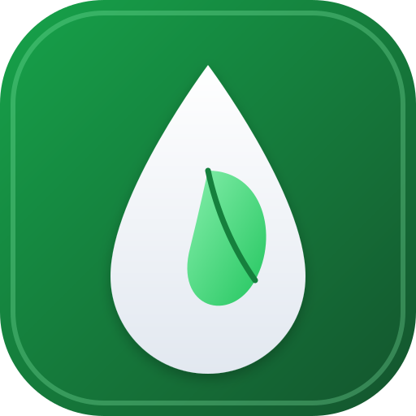

# 🌿 DailyMarts — Daily Agricultural & Dairy Direct Ordering Platform



[](https://reactjs.org/)
[](https://dotnet.microsoft.com/)
[](https://docs.microsoft.com/en-us/dotnet/csharp/)
[](https://www.mongodb.com/atlas)
[](https://resend.com)
[](https://vitejs.dev/)
[](#license)

**DailyMarts** is a full-stack daily agricultural and dairy product platform powered by **ASP.NET Core 8.0 (C#) Web API** and **React 18** connecting local **Farmers** directly with **Customers**. The platform powers daily fresh milk deliveries, milk products, organic vegetables, chicken, and meat subscriptions with daily yield capacity management, direct UPI QR payments, peer-to-peer farmer product exchange, and automated email notifications.

---

## ✨ Key Features & Capability Overview

### 🌾 Farmer Capabilities
- **🥛 Daily Milking Yield & Capacity Control**: Manage daily available milk volume (L) and dairy product capacities with real-time stepper adjustments.
- **🚚 Route & Order Fulfillment**: Track morning (6:00–8:00 AM) & evening household delivery routes and mark orders as supplied.
- **💰 Customer Ledger & Payment Confirmation**: View pending customer UPI transfers, review transaction references, and approve payments to reduce customer bill balances and credit the farmer wallet.
- **🤝 Farmer-to-Farmer Exchange Network**: Post excess milk supply requests or supply nearby partner farmers based on geospatial 2dsphere proximity.
- **📧 Direct Customer Email Communication**: Send custom email updates (delivery slots, batch purity test reports) directly to customers via Resend.
- **📊 Sales Analytics & Reporting**: Interactive volume & revenue trend charts powered by `Recharts`.

### 👤 Customer Capabilities
- **🥛 Fresh Product Catalog**: Browse certified fresh milk (A2 Cow, Buffalo), dairy products (Ghee, Paneer, Butter), organic vegetables, and meats.
- **🔄 Recurring Daily Subscriptions**: Setup, pause, skip, or cancel recurring daily deliveries with flexible quantity management.
- **💳 UPI QR Payment Generator**: Scannable `upi://pay` QR code generated automatically from the farmer's registered UPI VPA (works with GPay, PhonePe, Paytm, BHIM).
- **📄 Monthly Invoice & Billing Ledger**: View itemized monthly bills derived strictly from verified `DELIVERED` status records.
- **🔔 Notification Center**: Real-time alerts and email notifications for bill generation, payment confirmations, and delivery updates.

---

## 🏗️ Tech Stack & System Architecture

```
                       ┌─────────────────────────┐
                       │     React 18 + Vite     │  (Frontend Single Page Application)
                       │   Vanilla CSS (Modern)  │
                       └────────────┬────────────┘
                                    │
                             REST API (JSON)
                                    │
                       ┌────────────▼────────────┐
                       │  ASP.NET Core 8.0 API   │  (RESTful C# Web API Architecture)
                       │   JWT Auth & BCrypt     │
                       └─────┬──────────────┬────┘
                             │              │
        ┌────────────────────▼──┐        ┌──▼──────────────────┐
        │  MongoDB Atlas (Cloud)│        │   Resend Email API  │
        │ MongoDB.Driver 2dsphere│       │ (Transactional Mail)│
        └───────────────────────┘        └─────────────────────┘
```

| Layer | Technology Used |
|---|---|
| **Frontend** | React 18, Vite, React Router v6, Axios, Recharts, QRCode.react, Lucide-style CSS |
| **Backend** | ASP.NET Core 8.0 Web API, C#, Controllers & Dependency Injection |
| **Database** | MongoDB Atlas, `MongoDB.Driver`, GeoJSON `2dsphere` Proximity Indexing |
| **Authentication** | JSON Web Tokens (JWT Bearer), Password Hashing via `BCrypt.Net-Next` |
| **Email Service** | Resend API SDK with responsive HTML templates |
| **Background Jobs** | `CronBackgroundService` (`IHostedService`) for midnight delivery generation |
| **Styling System** | Custom Vanilla CSS Design System with dark mode support & CSS variables |

---

## 📁 Repository Structure

```
.
├── backend-dotnet/                 # ASP.NET Core 8.0 Web API Server
│   ├── Controllers/                # API Controllers (Auth, Products, Orders, Payments, etc.)
│   ├── Data/                       # MongoDbContext & Database Indexing
│   ├── DTOs/                       # Request & Response Data Transfer Objects
│   ├── Helpers/                    # ApiResponse envelope & IdGenerator
│   ├── Middleware/                 # ExceptionHandlingMiddleware
│   ├── Models/                     # MongoDB BSON Models (User, Product, Order, Bill, etc.)
│   ├── Services/                   # JwtService, EmailService, CronBackgroundService, DatabaseSeeder
│   ├── appsettings.json            # MongoDB, JWT & Resend configuration
│   ├── DailyMarts.Api.csproj       # .NET 8.0 C# Project File
│   └── Program.cs                  # Web Application Entry Point & Middleware Pipeline
├── public/                         # Static assets (Favicon, Logo SVGs)
├── src/                            # React Frontend Source Code
│   ├── components/                 # Shared UI components (Navbar, Sidebar, Modal)
│   ├── context/                    # AuthContext & ToastContext
│   ├── layouts/                    # Farmer & Customer layout wrappers
│   ├── pages/                      # Role-specific application pages
│   │   ├── auth/                   # Login & Registration pages
│   │   ├── customer/               # Customer Dashboard, Products, Billing, Payments
│   │   └── farmer/                 # Farmer Dashboard, Capacity, Exchange, Ledger
│   ├── services/                   # Frontend Axios API client service mapping
│   └── utils/                      # Currency formatters & Mock fallbacks
├── index.html                      # HTML Entry point
├── vite.config.js                  # Vite configuration & Backend proxy setup
└── README.md                       # Documentation
```

---

## 🔌 Core REST API Endpoint Reference

### 🔐 Authentication (`/api/auth`)
- `POST /api/auth/register` — Register a new Customer or Farmer (collects `upiId` for farmers)
- `POST /api/auth/login` — Authenticate user and issue JWT token
- `GET  /api/auth/me` — Fetch currently logged-in user profile
- `PUT  /api/auth/profile` — Update profile & farmer attributes

### 🥛 Products (`/api/products`)
- `GET  /api/products` — Search & filter available products
- `GET  /api/products/{id}` — Get single product details
- `POST /api/products` — Create new product (Farmer only)
- `PUT  /api/products/{id}` — Update product details
- `DELETE /api/products/{id}` — Delete product
- `PATCH /api/products/{id}/capacity` — Update daily stock capacity

### 📦 Orders & Subscriptions (`/api/orders`, `/api/subscriptions`)
- `POST /api/orders` — Place one-time order
- `GET  /api/orders` — Fetch user orders
- `POST /api/subscriptions` — Create recurring milk subscription
- `GET  /api/subscriptions` — List recurring subscriptions

### 💳 Payments & Billing (`/api/payments` & `/api/bills`)
- `GET  /api/payments/farmer-upi/{farmerId}` — Fetch farmer's registered UPI ID for QR generation
- `POST /api/payments` — Record customer UPI transfer (creates `PENDING` request)
- `GET  /api/payments/pending` — Fetch pending payments awaiting farmer approval
- `PATCH /api/payments/{paymentId}/confirm` — Farmer marks payment received → deducts bill balance
- `GET  /api/bills` — Fetch customer/farmer monthly billing ledger

### 📧 Notifications & Reports (`/api/notifications`, `/api/reports`)
- `POST /api/notifications/remind/{customerId}` — Trigger payment reminder email & notification
- `POST /api/notifications/send-email` — Send direct custom email from farmer to customer via Resend
- `GET  /api/reports/farmer/stats` — Aggregated sales & financial statistics

---

## 🚀 Getting Started & Local Installation

### Prerequisites
- **.NET 8.0 SDK**: [Download .NET 8.0](https://dotnet.microsoft.com/download/dotnet/8.0)
- **Node.js**: `v18.x` or higher
- **MongoDB Atlas** account (or local MongoDB server)
- **Resend API Key**: [resend.com](https://resend.com)

### 1. Clone the Repository
```bash
git clone https://github.com/BHAGAVATHIRAJA26/DailyMarts-.NET-.git
cd DailyMarts-.NET-
```

### 2. Configure ASP.NET Core Backend
Navigate to `backend-dotnet/` and verify `appsettings.json`:
```json
{
  "MongoDbSettings": {
    "ConnectionString": "mongodb+srv://<username>:<password>@cluster0.mongodb.net/dailymarts?retryWrites=true&w=majority",
    "DatabaseName": "dailymarts"
  },
  "JwtSettings": {
    "Secret": "dailymarts_super_secret_jwt_key_2026_dindigul_tamilnadu_secure_token_12345",
    "ExpiryDays": 30
  },
  "ResendSettings": {
    "ApiKey": "re_your_resend_api_key_here"
  }
}
```

### 3. Run Development Servers

```bash
# Terminal 1: ASP.NET Core 8.0 Web API Server (Port 5000)
cd backend-dotnet
dotnet run

# Terminal 2: Frontend Client (Port 5173)
npm install
npm run dev
```

Open your browser and navigate to `http://localhost:5173` (Frontend) or `http://localhost:5000/swagger` (Interactive API Documentation).

---

## 🔑 Demo Test Login Credentials

| Role | Email | Password | Details |
|---|---|---|---|
| 🌾 **Farmer** | `farmer@dailymarts.com` | `farmer123` | Farm: *Velliangiri Organic Farm*, UPI: `muthusamy@upi` |
| 🌾 **Farmer (Alt)** | `kannammal@dailymarts.com` | `farmer123` | Farm: *Sri Green Organic Dairy*, UPI: `kannammal@okaxis` |
| 👤 **Customer** | `customer@dailymarts.com` | `customer123` | Name: *Anitha Ramesh*, Location: *Dindigul* |

---

## 📄 License
Distributed under the **MIT License**. See `LICENSE` for more information.

---

<p align="center">
Made with ❤️ for local dairy farmers and healthy families powered by ASP.NET Core 8.0 & React.
</p>
